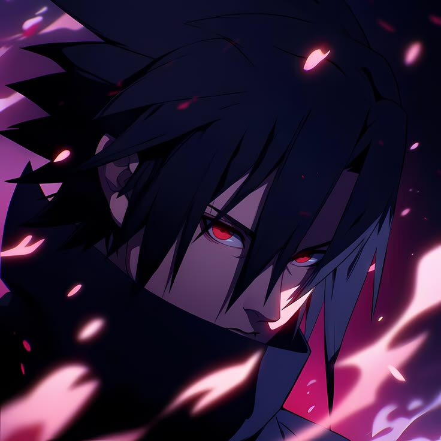

# HANSZ — Video Editor / Link-in-Bio

Static personal profile untuk **video editor / content creator**.
Dark cinematic + glassmorphism + particle background.
HTML + CSS + Vanilla JS saja — **tanpa framework**, langsung bisa di-deploy ke Vercel.

```
/
├── index.html
├── style.css
├── script.js
└── assets/
    ├── zuan.jpeg     ← foto profil (736×768, sudah dipasang)
    └── favicon.svg
```

## Isi halaman

1. **Background** — subtle grid, particle (canvas), aurora glow, scanline, noise, vignette
2. **Profile** — foto lingkaran + cincin berputar + glow + nama
3. **Social icons** — Instagram, TikTok, YouTube, Telegram, Discord, WhatsApp
4. **Link cards** — kategori: Socials / My Work / Services & Store / Contact

## Ganti isi

### Foto profil
Sekarang memakai `assets/zuan.jpeg`. Untuk ganti, cukup replace file tersebut
(paling bagus **persegi 1:1**, minimal 400×400), atau edit `src` + `alt` di
`index.html`:

```html

```

`width`/`height` wajib sesuai ukuran file asli supaya layout tidak meleset
saat loading.

### Nama & teks profil
`index.html` → blok `<div class="ident">`:

```html
<h1 class="ident__name"><span class="grad">Zuan</span></h1>
<p class="ident__role">Video Editor &amp; Creative Creator</p>
<p class="ident__bio">...</p>
```

### Link card + warna per link
Setiap card punya warnanya sendiri lewat atribut `data-c`. Kalau diklik, seluruh
warna halaman (nama, glow background, cincin foto, scrollbar, toast) **berganti
animasi** ke warna card itu + efek ripple dan sapuan cahaya.

```html
<a class="card" href="LINK-KAMU" target="_blank" rel="noopener noreferrer" data-c="violet">
  <span class="card__icon"><i class="fa-solid fa-photo-film"></i></span>
  <span class="card__body">
    <span class="card__title">Judul Link</span>
    <span class="card__desc">Deskripsi singkat</span>
  </span>
  <i class="card__go fa-solid fa-chevron-right" aria-hidden="true"></i>
  <span class="card__sweep" aria-hidden="true"></span>
</a>
```

Pilihan `data-c`: `cyan` · `violet` · `pink` · `amber` · `mint` · `blue` · `rose`

Untuk menambah warna sendiri, edit satu baris di `style.css`:

```css
.card[data-c="cyan"]{--c:#22d3ee}
```

Tampilan awal (sebelum ada card diklik) ada di `script.js` → `init()`:

```js
document.documentElement.setAttribute('data-accent', 'cyan');
```

.navigate tetap jalan normal; klik dengan `Ctrl`/`Cmd`/klik tengah tetap membuka
tab baru seperti bawaan browser.

### Ikon
Font Awesome 6 via CDN:
- Brand: `fa-brands fa-instagram`, `fa-tiktok`, `fa-youtube`, `fa-telegram`, `fa-discord`, `fa-whatsapp`
- Solid: `fa-solid fa-photo-film`, `fa-clapperboard`, `fa-cart-shopping`, `fa-laptop-code`, `fa-graduation-cap`, `fa-layer-group`, `fa-wand-magic-sparkles`
- Regular: `fa-regular fa-envelope`, `fa-regular fa-copy`

### Warna accent
`style.css` → `:root`:

```css
--a1:#00d4ff;   /* cyan   */
--a2:#7c4dff;   /* violet */
--a3:#ff2d78;   /* pink   */
--warm:#ff7a18; /* oranye */
```

### Email / copy
Ganti `data-copy="..."` pada tombol email — teksnya ikut ter-copy + muncul toast.

### Particle
`script.js` → `CONFIG.particles`. Makin besar `density`, makin sedikit partikel
(lebih ringan untuk HP).

## Deploy ke Vercel

```bash
npx vercel
```

Atau connect repository di dashboard Vercel. Tidak ada build command, tidak ada
dependency — langsung_static.

## Catatan

- Particle canvas + efek berat lainnya otomatis dimatikan di HP, dan otomatis
  nonaktif kalau pengguna mengaktifkan *reduced motion*.
- Layout responsif: `1280px` (desktop lebar), `900px` (tablet), `760px` / `560px`
  / `400px` (phone), plus breakpoint khusus phone landscape & window pendek.
- Paddingsection memakai `env(safe-area-inset-*)` supaya aman di iPhone notch.
- Link `href="#"` sengaja dibuat inert (muncul toast) supaya tidak accidental
  navigate — ganti dengan URL asli.
- Kalau mau link WhatsApp: `https://wa.me/62XXXXXXXXX` (format internasional).
